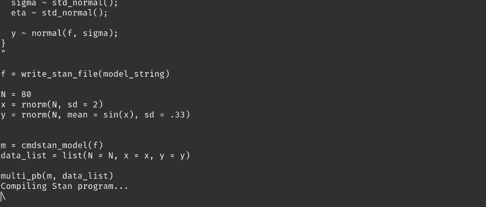

<!-- README.md is generated from README.Rmd. Please edit that file -->

# thebars

[THE BARS! THE BARS! THE LIE! THE
LIE!](https://www.youtube.com/watch?v=2-O32cr9l0Y)

<!-- badges: start -->
<!-- badges: end -->

The goal of `thebars` is to display concurrent progress bars for each
chain when running a Stan model with cmdstanr. A little demonstration:



This can help visualize the relative speed of MCMC chains. In the
example above all the chains are marching along at a relatively even
pace, but if some chains lag behind others that can indicate they’re
stuck and not converging properly.

## Installation

You can install the development version of thebars like so:

``` r
remotes::install_github("andrewGhazi/thebars")
```

## Example

This example adapts the [Latent variable
GP](https://mc-stan.org/docs/stan-users-guide/gaussian-processes.html#latent-variable-gp)
example from the Stan docs. Compile the model as usual and pass the
`CmdStanModel` object `m` and the data list `data_list` to
`thebars::multi_pb()` like so:

``` r
library(thebars)
library(cmdstanr)

model_string = "
data {
  int<lower=1> N;
  array[N] real x;
  vector[N] y;
}
transformed data {
  real delta = 1e-9;
}
parameters {
  real<lower=0> rho;
  real<lower=0> alpha;
  real<lower=0> sigma;
  vector[N] eta;
}
model {
  vector[N] f;
  {
    matrix[N, N] L_K;
    matrix[N, N] K = gp_exp_quad_cov(x, alpha, rho);

    // diagonal elements
    for (n in 1:N) {
      K[n, n] = K[n, n] + delta;
    }

    L_K = cholesky_decompose(K);
    f = L_K * eta;
  }

  rho ~ inv_gamma(5, 5);
  alpha ~ std_normal();
  sigma ~ std_normal();
  eta ~ std_normal();

  y ~ normal(f, sigma);
}
"

N = 80
x = rnorm(N, sd = 2)
y = rnorm(N, mean = sin(x), sd = .33)

f = write_stan_file(model_string)
m = cmdstan_model(f)
data_list = list(N = N, x = x, y = y)

multi_pb(m, data_list) 
```

It works by:

- Running the sampler inside of an asynchronous `mirai`
- counting the lines in the output CSVs with `grep` and `wc -l`
- using ANSI cursor movements (see [this stackoverflow
  thread](https://stackoverflow.com/a/49232576)) to move the cursor
  around and draw the bars with `txtProgressBar()`. It also shows an ETA
  of the slowest chain.

## Limitations

- Doesn’t work in RStudio (no up/down ANSI cursor movements)
- Doesn’t adapt to console width
- Restricted to four chains
- Restricted to default arguments to `cmdstanr::sample`
- Probably a lot of other details that I haven’t tested.

## Things I’ll implement if I feel like it / can figure out how

- Adaptation to `num_chains != 4`
- RStudio support? Probably not possible without some method beside ANSI
  escape sequences
- Additional `cmdstanr::sample` arguments with `...`
